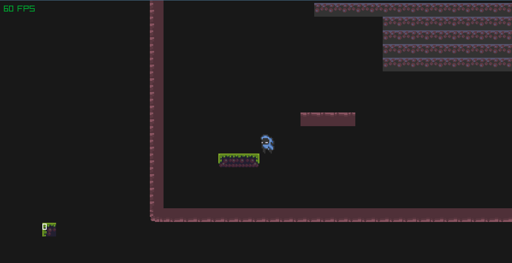
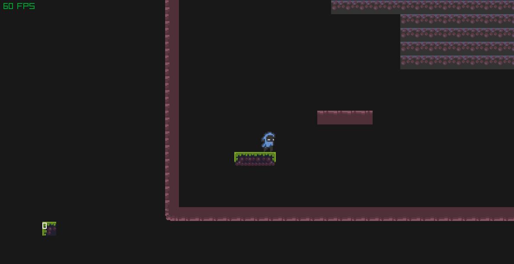

# Wallhugger

This game was written in C using the raylib library.

## TODOS

- [X] Gravity
- [X] Jumping
  - [X] Animation
- [X] Collision
- [X] Double Jumping
  - [X] Animation
  - [X] logic
- [X] simple Map editor
  - [X] fix bug where you are only able to place the blocks from right to left
  - [X] add funtion to delete single blocks
  - [X] save and read map
  - [X] add option to change blocks
  - [X] fix camera bug (when trying to place blocks in the tile and the camera changes the blocks will go outside the grid)
- [X] add camera
- [X] optimize performance
- [ ] Windows support
- [X] create dynamic array
- [X] add noclip for debugging
- [X] add cmake

## Demo

### Platforming

You get all your jumps back after you touch a wall.

### Map editor

The map editor allows you to serialize and deserialize your creations. (load and save maps)

